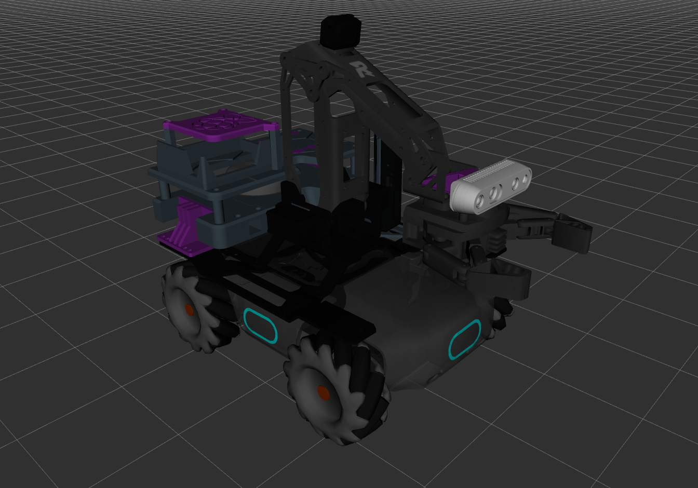
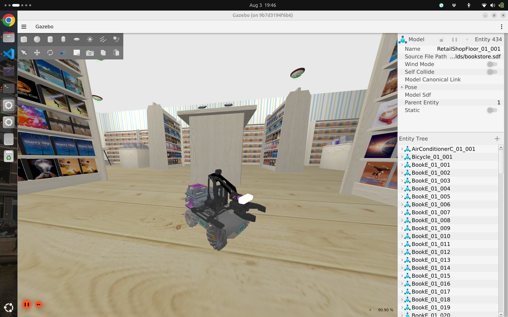
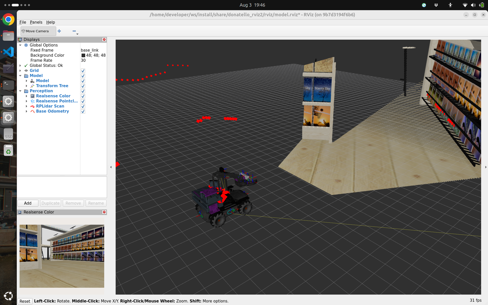

# Donatello the Robot

Donatello is a one-off robot built using a [DJI Robomaster EP](https://www.dji.com/global/robomaster-ep-core) Core as omnidirectional mobile platform, and further equipped with sensors and processing for autonomous navigation and mapping.



As of now, this still an ongoing project, and both the hardware and software are still in development. This repository contains the software stack for the robot, and simulations and development resources.

## Basic description

### Hardware

The mobile platform of the robot is a [DJI Robomaster EP Core](https://www.dji.com/global/robomaster-ep-core), a mecanum wheeled robot with a 2-DOF robotic arm. On top of this platform, perception is provided by a [Intel RealSense D435i](https://www.intelrealsense.com/depth-camera-d435i/) depth camera, and a [RPLidar A2](https://www.slamtec.com/en/Lidar/A2) 2D lidar. The brain of the robot is a Raspberry Pi 5 with a 250GB NVMe storage for high speed on-board data storage.

### Software

The software stack is based on a dockerized ROS 2 application based on ROS 2 Humble. The Raspberry Pi 5 host runs Raspberry Pi OS Bookworm.

The software borrows heavily from the excellent [robomaster_ros](https://github.com/jeguzzi/robomaster_ros) package by [jeguzzi](https://github.com/jeguzzi) that allows the integration between the DJI Robomaster EP Core and ROS 2.

The software includes both real and simulated environments for the robot. The simulation is based on Gazebo Fortress.




## Usage of this repo

### Development docker container

The stack is designed to be fully containerized, for ease of development and ease of deployment. The development container is based on the ROS 2 Humble image, with some additional packages installed. The source code is mounted as a volume in the container, so that changes to the source code are immediately available in the container.

To build the development container, run the following command:

```bash
./docker/run.sh --build
```

### Running the software stack in simulation

To run the software stack in simulation, build the development container and run the following command once inside the terminal:

```bash
colcon build --merge-install --symlink-install \
 && source install/setup.bash \
 && ros2 launch donatello_bringup_sim main.launch.py rviz:=true gz_gui:=true
```

To control the robot you'll need a gamepad. Alternatively, you can use the keyboard to control the robot if you launch the system with the `input_type:=keyboard` argument.

### Running the software stack on the real robot

```bash
colcon build --merge-install --symlink-install \
 && source install/setup.bash \
 && ros2 launch donatello_bringup_realbot main.launch.py map_name:=home_berisso
```
